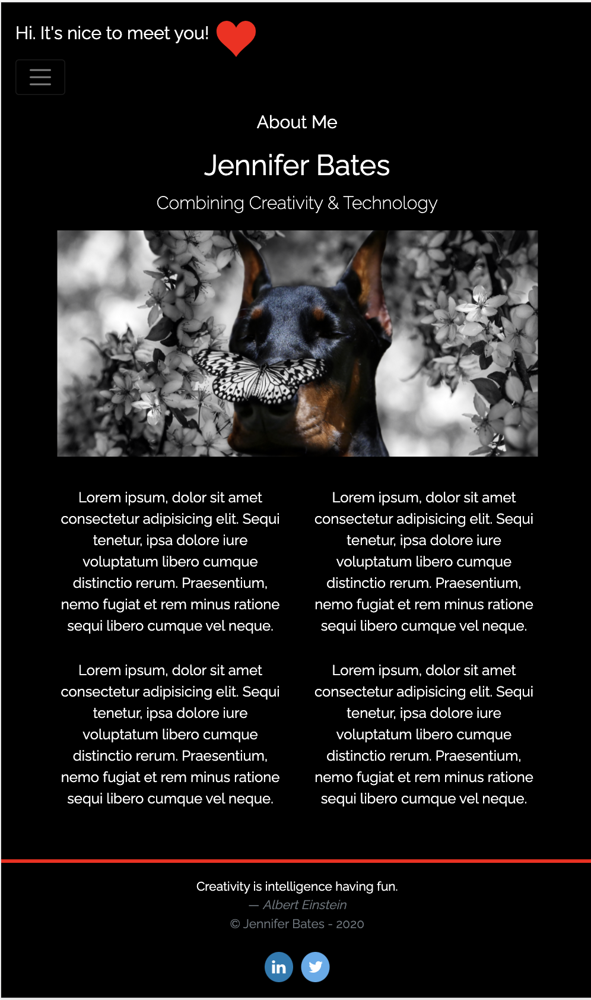

         

---
# Responsive Portfolio Project  
## Responsive Portfolio Project Using CSS and Bootstrap
---

#### This was a project creating a responsive portfolio using CSS3 and Bootstrap 4. The project scope sought a responsive design ensuring the portfolio rendered well on a variety of devices. 

#### Completion of the acceptance criteria provided the following items:
#####   - An index (homepage), portfolio page and contact page.
#####   - A consistent navbar across all three pages containing links to all website pages.
#####   - All links are working.
#####   - Each page has valid and correct HTML.
#####   - Semantic HTML elements are used which follow a logical structure.
#####   - Personalized information included bio, name, images, links to social media, etc.
#####   - Proper use of Bootstrap components and grid system.
#####   - A sticky footer.
#####   - Sub-rows and/or sub-columns.

#### The following are screenshots of the portfolio and overview of its functionality:

 

    
Fun Fact

    The red dobermans in the artwork are my own (four-legged) children.
    

 

  
#### Articles and sites which contributed toward the successful completion of this project are included below:

[MDBootstrap](https://mdbootstrap.com/docs/jquery/forms/contact/)  
[GetBootstrap](https://getbootstrap.com/docs/4.0/)  
[Semantic HTML](https://www.pluralsight.com/guides/semantic-html)   
[Learn CSS Layout](https://learnlayout.com/no-layout.html)  
[How To Style Images With Markdown Blog](https://www.xaprb.com/blog/how-to-style-images-with-markdown/)  
[Shields IO](https://shields.io/)  

#### Project Repo and GitHub links:  

[Repo](https://onomatopoetica.github.io/02-portfolio/)  
[GitHub](https://github.com/onomatopoetica/02-Portfolio/)
